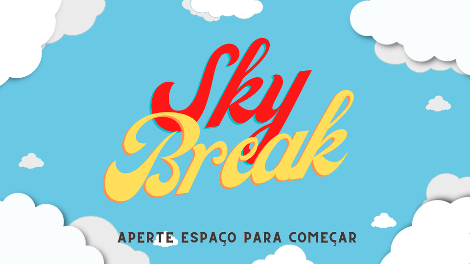
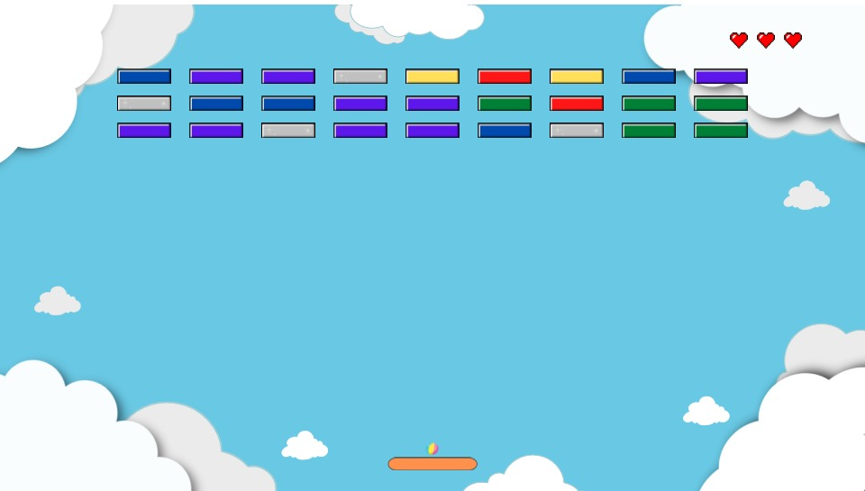

# BreakOut
Game develop in C++ for the Geme Development course of Computer Science BS at UFERSA.
Break-out type game - the goal is to break all the blocks with a ball by controlling it's movements.

